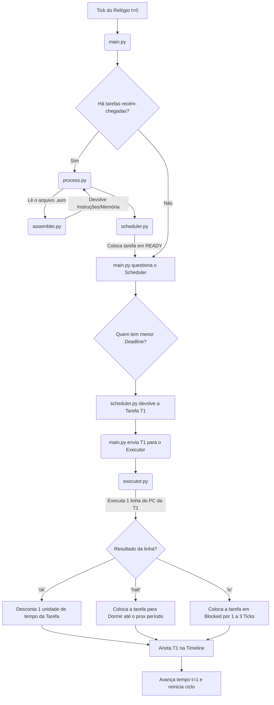

# Arquitetura do Sistema: Simulador EDF

## Objetivo do Projeto
Desenvolver um simulador capaz de executar pequenos programas escritos em um "Assembly Hipotético". O coração do projeto é a implementação do algoritmo de escalonamento **EDF (Earliest Deadline First)**, que orquestra a execução de múltiplas tarefas periódicas, garantindo preempção por prioridade absoluta de deadline e o tratamento de interrupções de I/O.

---

## Os 5 Módulos do Sistema

Para manter o código limpo, testável e robusto (evitando o antipadrão "Código Deus"), a arquitetura foi dividida em responsabilidades puras:

1. **`assembler.py` (O Parser / Tradutor)**
   - **Papel:** Ler os arquivos `.asm` e gerar listas e dicionários limpos.
   - **Por que existe?** Para retirar da CPU a carga de entender strings, comentários ou labels. Entrega o código já formatado e "mastigado".

2. **`process.py` (O Bloco de Controle de Processo - PCB)**
   - **Papel:** É o Prontuário do Paciente. Uma classe puramente estrutural.
   - **O que guarda?** Os ponteiros do sistema (`pc`, `acc`), a área de memória (`data`), as regras do trabalho (`deadline`, `Ci`, `Pi`) e o estado (READY, RUNNING, WAITING, BLOCKED).

3. **`executor.py` (A Unidade Lógica e Aritmética - ALU/CPU)**
   - **Papel:** O motor braçal de processamento de instruções matemáticas e de saltos.
   - **Como funciona?** Só possui uma função pública genérica. O sistema lhe entrega um Processo, e a CPU executa UMA linha do código baseada onde o `pc` do processo estiver apontando, avançando em seguida.

4. **`scheduler.py` (A Fila de Prioridades do EDF)**
   - **Papel:** Organizar quem é o próximo na fila do pão.
   - **Como funciona?** Não executa nada. Apenas insere Processos em uma Fila de Prontos (`ready_queue`). Quando questionado "quem é o próximo?", devolve invariavelmente aquele cujo `absolute_deadline` for o menor.

5. **`main.py` (O Relógio Central / Placa Mãe)**
   - **Papel:** O regente da orquestra. Mantém um contador `time` central que sobe a cada *tick* no loop principal do sistema.
   - **Por que existe?** Coordena os demais: acorda tarefas que estavam em WAITING, pergunta ao `scheduler` quem roda, passa a tarefa ao `executor` para realizar 1 tick, verifica se alguém perdeu deadline, e desenha o Gráfico de Gantt no final.

---

## Fluxo de Execução Simplificado

O simulador trabalha em **Ticks (ciclos de relógio)**. Veja um fluxo básico de um tick:

### O Triângulo de Ouro:
* **`main`** controla o tempo.
* **`scheduler`** controla a ordem.
* **`executor`** controla a matemática.
